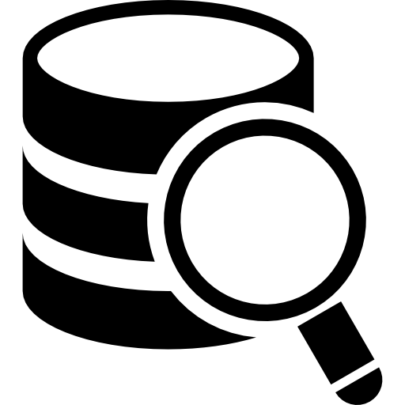
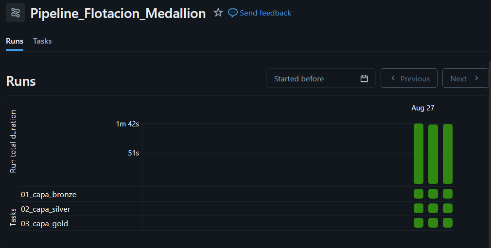
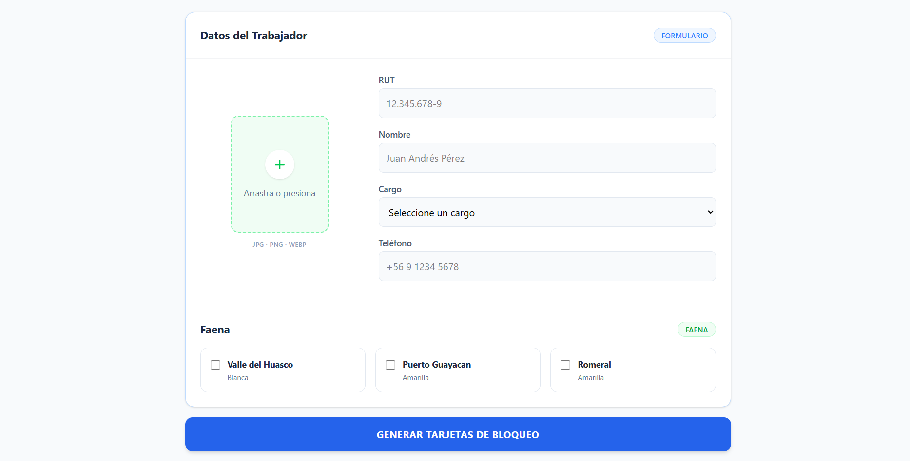
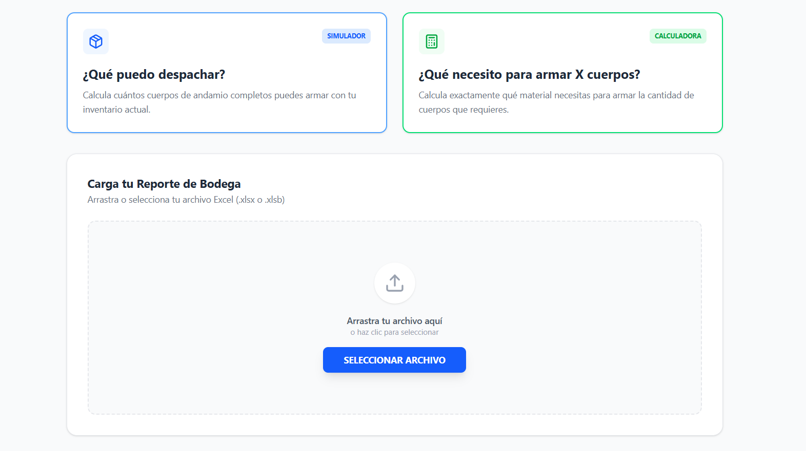
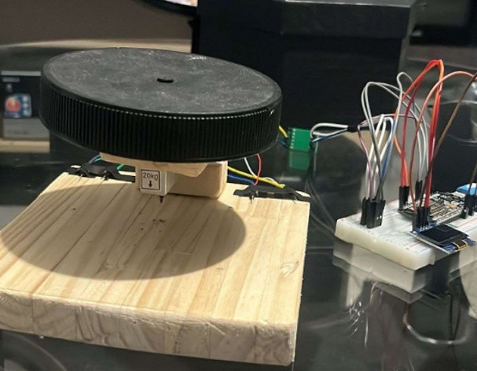
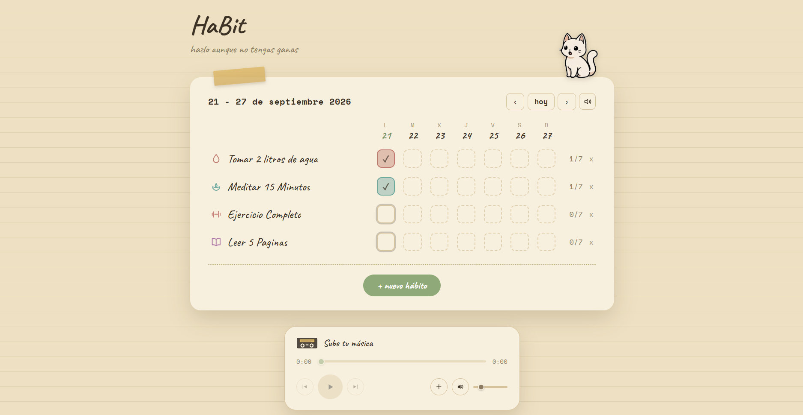

# Benjamin Villalobos Álvarez

### Ingeniero en Informática — Enfocado en Ingeniería en Datos, Automatización & IA Aplicada

 

---

## 👋 Sobre mí
Construyo soluciones que transforman datos y tareas manuales en procesos automáticos, confiables y medibles. Mi motivación nace de algo simple: tanto trabajando como estudiando, me he dado cuenta de lo frustrante que puede ser un proceso lento y repetitivo — por eso mi foco está en identificar esos puntos críticos y proponer propuestas de mejora. Actualmente en aprendizaje constante, integrando nuevas soluciones a mi día a día.

**🎯 Buscando** oportunidades para desarrollarme en roles de Automatización, Desarrollo de Software o Ingeniería de Datos.

 

## 🛠️ Arsenal Tecnológico

<table>
<tr>
<td valign="top" width="33%" align="center">

### Datos & BI
 

</td>
<td valign="top" width="33%" align="center">

### Automatización & Apps
 

</td>
<td valign="top" width="33%" align="center">

### Cloud & DevOps
 

</td>
</tr>
</table>

 

## 📌 Proyectos Destacados

 

### 1️⃣ Pipeline Big Data con Arquitectura Medallion — Sector Minero

<table>
<tr>
<td width="45%">

</td>
<td width="55%" valign="top">

**Problema:** una planta minera de hierro y sílice necesitaba estructurar grandes volúmenes de telemetría para resolver requerimientos críticos de control de calidad y eficiencia de reactivos.

**Solución:** implementación de Arquitectura Medallón (Bronze → Silver → Gold) en Databricks con PySpark, con procesos de ingesta, estandarización y agregación distribuida.

**Resultado:** 3 requerimientos críticos de negocio resueltos, con trazabilidad e integración continua entre Databricks y GitHub.

`Databricks` `PySpark` `SQL` `Medallion Architecture`

</td>
</tr>
</table>

 

### 2️⃣ Sistema Automatizado de Extracción y Procesamiento de Datos

<table>
<tr>
<td width="45%">

</td>
<td width="55%" valign="top">

**Problema:** carga manual de resoluciones de entes regulatorios en Chile, un proceso lento y propenso a errores.

**Solución:** agentes de IA en Python con OCR + NLP para transformar documentos no estructurados en esquemas tabulares relacionales, persistidos en SQL Server y desplegados en contenedores Docker sobre Linux.

**Resultado:** tiempo operativo reducido en **99%** (de 4 horas a 2 minutos).

`Python` `OCR` `NLP` `Docker` `SQL Server`

</td>
</tr>
</table>

 

### 3️⃣ Generador Automático de Tarjetas en Excel

<table>
<tr>
<td width="45%">

</td>
<td width="55%" valign="top">

**Problema:** llenado manual de tarjetas en Excel (hasta 3 por trabajador), con formatos que se descuadraban y generaban errores.

**Solución:** lógica de automatización en Python con frontend ligero en React, empaquetado con Tauri para mantener la app liviana.

**Resultado:** tiempo de la tarea reducido en **más de 70%**, eliminando los errores de formato.

`Python` `React` `Tauri`

</td>
</tr>
</table>

 

### 4️⃣ Sistema de Gestión y Conteo de Andamios

<table>
<tr>
<td width="45%">

</td>
<td width="55%" valign="top">

**Problema:** control manual de inventario y cálculo de cuerpos de andamios en logística de bodega.

**Solución:** aplicación con lógica de cálculo en Python y frontend en React (Tauri) que estima de forma autónoma el stock necesario según disponibilidad actual en la ubicación.

**Resultado:** proceso logístico agilizado, usado activamente en la operación diaria.

`Python` `React` `Tauri`

</td>
</tr>
</table>

 

### 5️⃣ Sistema de Telemetría IoT y Asistente Virtual

<table>
<tr>
<td width="45%">

</td>
<td width="55%" valign="top">

**Problema:** ingesta de inventario en tiempo real sin visibilidad centralizada ni forma rápida de consultarla.

**Solución:** prototipo IoT sincronizado vía Power Automate hacia una base centralizada, con un agente de IA conversacional en WhatsApp (NLP + Azure Speech-to-Text) para consultas ejecutivas.

**Resultado:** consultas de inventario resueltas de forma autónoma, sin intervención manual.

`IoT` `Power Automate` `NLP` `Azure`

</td>
</tr>
</table>

 

### 6️⃣ Vehículo IoT Anticolisión

<table>
<tr>
<td width="45%">

</td>
<td width="55%" valign="top">

**Problema:** explorar detección de obstáculos en tiempo real sobre un vehículo autónomo a escala.

**Solución:** prototipo sobre chasis tipo tanque con microcontrolador ESP32, sensores de proximidad y luces LED, comunicado vía protocolo MQTT como sistema anticolisión.

**Resultado:** prueba de concepto funcional de hardware + comunicación en tiempo real, fuera del stack habitual de software.

`ESP32` `MQTT` `IoT`

</td>
</tr>
</table>

 

### 7️⃣ HaBit — Habit Tracker

<table>
<tr>
<td width="45%">

<td width="55%" valign="top">

**Problema:** necesitaba una herramienta de seguimiento de hábitos hecha a la medida de mi propio uso diario.

**Solución:** aplicación de escritorio en JavaScript/Electron, construida como prueba práctica del uso de Claude para desarrollo de software real.

**Resultado:** app totalmente funcional, en mejora constante, con miras a publicarla eventualmente.

`JavaScript` `Electron`

</td>
</tr>
</table>

 

### 🚧 Próximamente: Generación de KPIs desde Simulación de Flota CAEX

<table>
<tr>
<td width="45%">

</td>
<td width="55%" valign="top">

**Problema:** generar KPIs operativos a partir de datos de una flota de camiones CAEX, en tiempo real.

**Solución (en curso):** simulación en Python de un flujo continuo de datos de 5 camiones, ingeridos vía Kafka y procesados en PySpark bajo arquitectura Medallion (Bronze, Silver, Gold). Incluye un módulo desacoplado para gestión de cambios de turno, pensado para extenderse fácilmente.

**Estado:** pipeline de ingesta y procesamiento en construcción — mi proyecto ancla actual.

`Python` `Kafka` `PySpark` `Medallion Architecture`

</td>
</tr>
</table>

 

---

---
